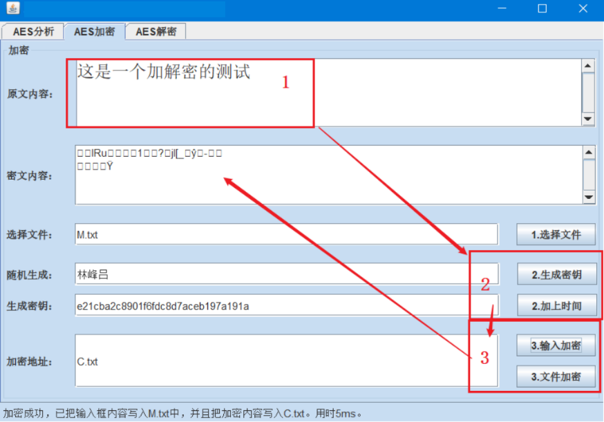
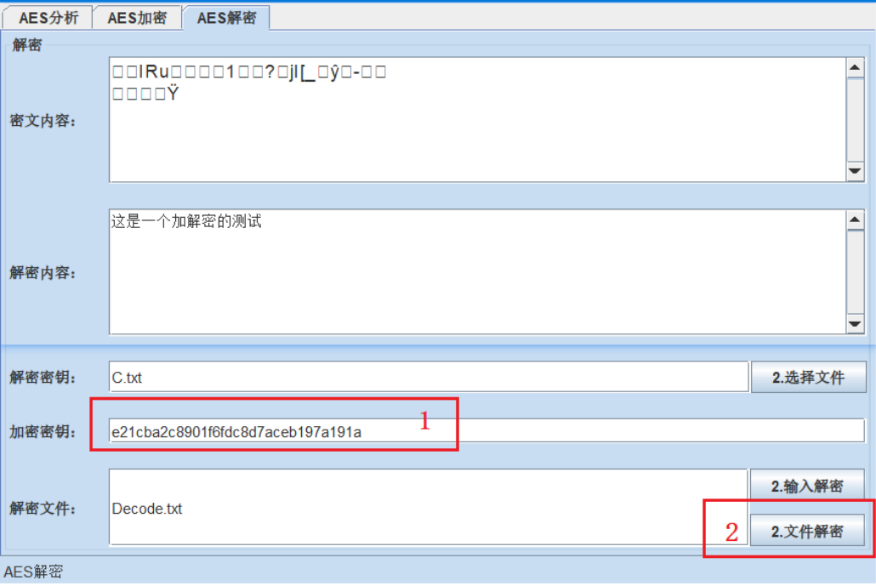
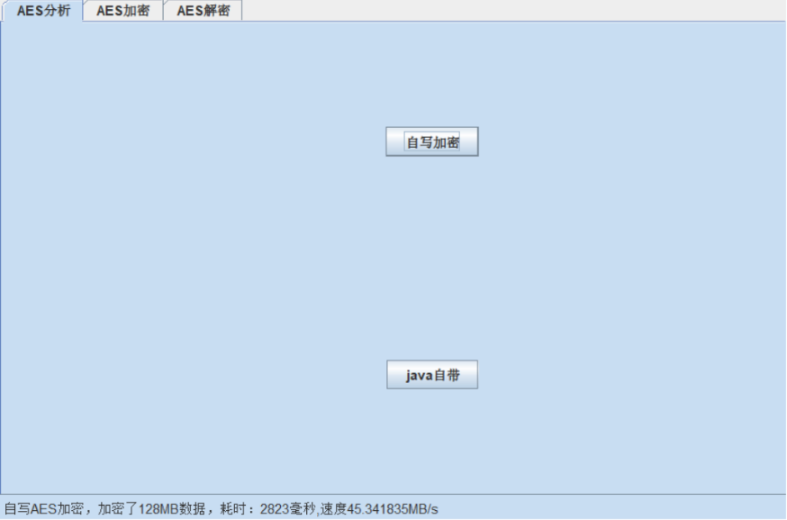

# AES 算法实现，T表高性能优化，带UI界面

大三密码学的结课项目，最近看到这个repo，完善一下说明纪念回不去的岁月

# 概要

1. 从零开始实现了AES加解密算法
   1. S盒和逆S盒的查找表
   2. 列混淆计算的查找表
   3. 引入了T表和逆T表，这是在AES中把中间九轮运算的S盒、列混淆的计算一并查询的的表，可以大大减少计算速度
2. 支持文件加解密
3. 支持生成密钥用来加解密

2. 基于swingUI的可视化窗口
3. 支持与Java的AES库进行加密吞吐率对比，本实现的吞吐率有45MB/s，而Java原生AES库的吞吐率仅有19MB/s

## Demo

### AES加密页面

### AES解密页面

### 与Java的AES库进行加密吞吐率对比

